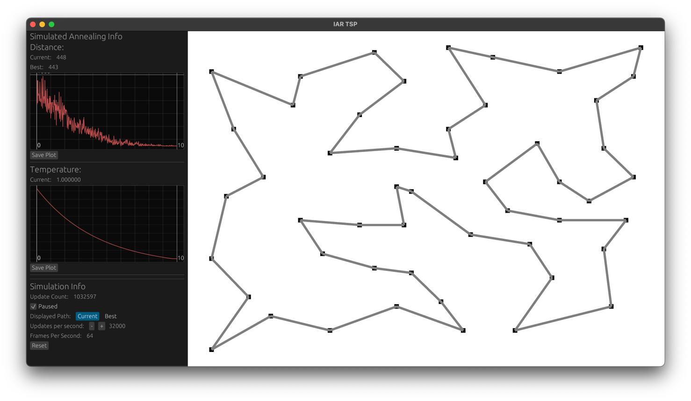
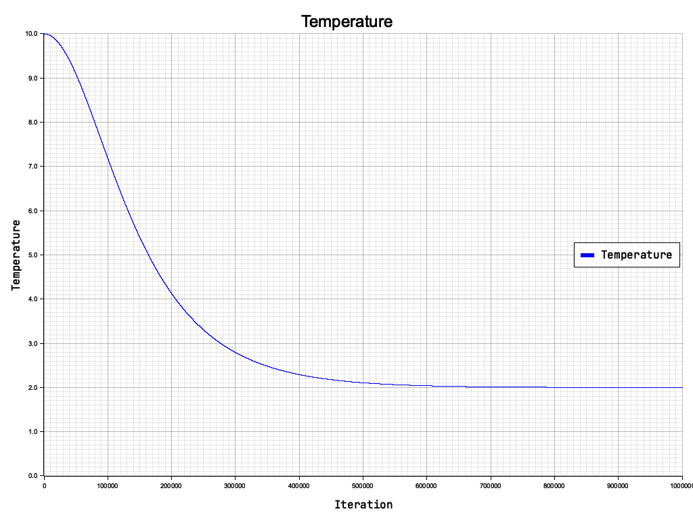
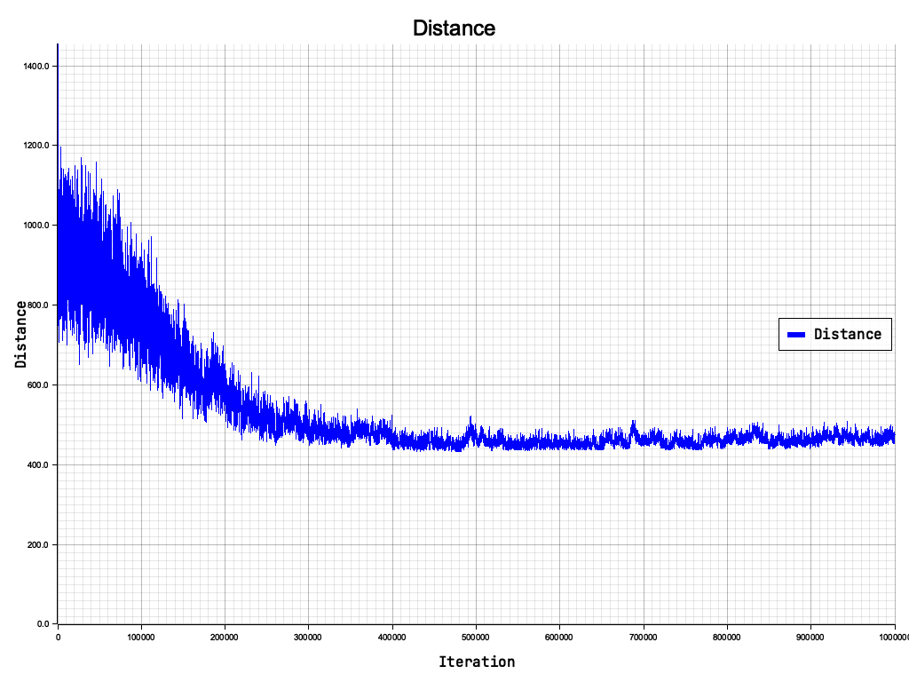
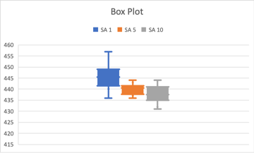
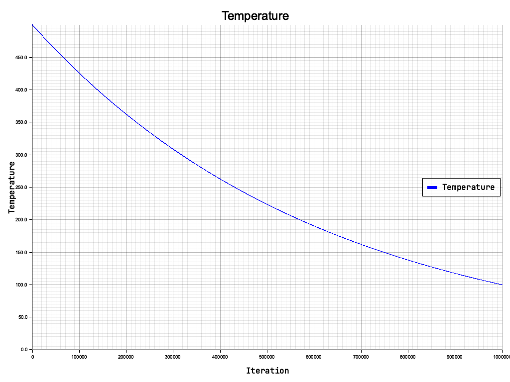
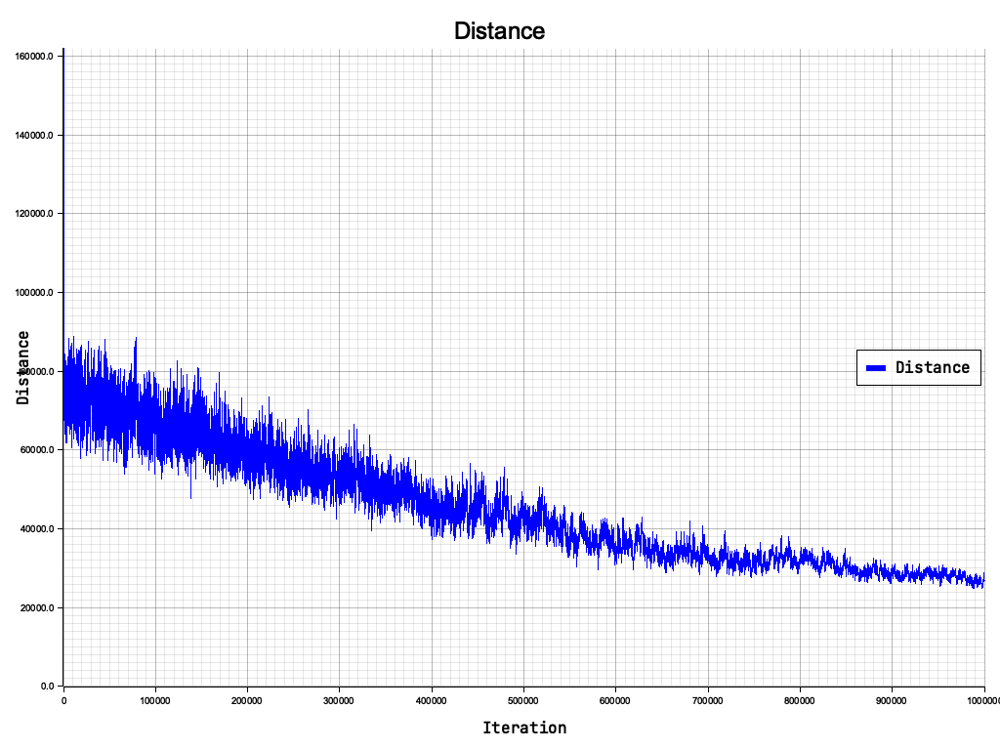
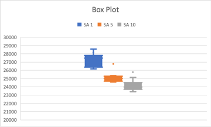

# IAR TSP

Simulated Annealing para o problema do caxeiro viajante

Implementado com interface grafica que mostra o menor caminho, os graficos de distancia e temperatura em tempo real

### eil51

Foi utilizado temperatura inicial de 10 e final de 2

Funcão de resfriamento:

Gráfico de convergencia:

Box Plot:

### kroA100

Foi utilizado temperatura inicial de 500 e final de 100

Funcão de resfriamento:

Gráfico de convergencia:

Box Plot:

